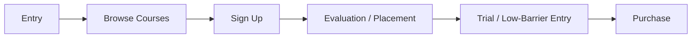

# Project Summary

## Executive Summary

This case study evaluates conversion friction in an online education user journey. The analysis compares Think Academy with AoPS Academy from the perspective of a parent researching math programs, moving from search entry through browsing, sign-up, evaluation, trial, and purchase.

The analysis found three main drop-off risks for Think Academy:

- key decision-making information was not visible enough on core course pages
- evaluation prompts appeared too early and too frequently during browsing
- low-risk conversion aids, such as a low-cost trial and refund policy information, were difficult to find

The top recommendation is to make the existing low-cost trial option and refund/drop policies more discoverable at decision-heavy moments. This is a high-impact, low-effort improvement because the product and policies already exist; the main issue is visibility.

The project also includes a browser-side tracking review. Based on observed requests during testing, the current tracking setup appeared to have multiple reporting destinations, limited mid-funnel event coverage, and incomplete form identifiers. Improving the tracking plan would make future funnel optimization more measurable.

## Business Context

For parents evaluating an online education program, conversion is not only about checkout usability. It is also about reducing decision uncertainty:

- What course is right for my child?
- How much does it cost?
- Is an evaluation required?
- Is there a low-risk way to try the program first?
- What happens if the course is not a good fit?

If these questions are difficult to answer during browsing, users may register reluctantly, delay action, or switch to a competitor with clearer information.

## Public Portfolio Note

This project is a portfolio case study based on publicly accessible website walkthroughs and browser-side testing of Think Academy and AoPS Academy. The project does not use internal company data, and this repository does not include raw screenshots, private data, or tracking identifiers.

The measurement and dashboard recommendations should be read as proposed planning outputs rather than implemented tracking or live reporting.

## Journey Scope

The user journey was evaluated across six stages:

The analysis focused on course information clarity, pricing visibility, evaluation timing, low-risk entry options, refund policy visibility, and whether tracking coverage could support funnel diagnosis.

## Methodology: Hands-On Journey Testing

The analysis was conducted through a hands-on walkthrough from the perspective of a prospective parent evaluating online learning options. I reviewed search-entry paths, course browsing pages, sign-up flow, evaluation prompts, low-risk trial options, refund/drop policy visibility, and browser-side tracking requests.

The goal was to identify friction points that a real user might experience before committing to enrollment, then translate those observations into prioritized product and analytics recommendations.

## Data and Evidence

- Public website walkthroughs from a simulated parent perspective
- Search-entry and homepage-entry observations
- Course page browsing and sign-up flow testing
- Comparison with AoPS Academy as a benchmark platform in the same category
- Browser-side GA4 request inspection using Chrome DevTools
- Observed event names, form behavior, and measurement coverage gaps

Because the analysis uses external observation only, findings should be interpreted as a user journey and tracking review rather than a validated internal conversion study.

## Funnel Comparison

| Stage | Think Academy | AoPS Academy | User Decision Question |
| --- | --- | --- | --- |
| Browse | Think Academy had higher friction: key course information and pricing were less visible on core program pages | AoPS Academy had lower friction: pricing and course details were easier to review before sign-in | Which course fits best, and is the price acceptable? |
| Sign Up | Think Academy had lower friction: registration flow was relatively straightforward | AoPS Academy had medium friction: account setup involved more steps | Am I willing to register to continue? |
| Evaluation | Think Academy had higher friction: evaluation was emphasized repeatedly during browsing | AoPS Academy had medium friction: placement appeared closer to purchase intent | Am I ready to schedule or complete a placement step? |
| Trial / Low-Barrier Entry | Think Academy had higher friction: a low-cost trial option existed but was difficult to discover | AoPS Academy had medium friction: lower-risk entry options were easier to locate, though not always low-cost | Is there a low-risk way to try the program first? |
| Purchase | Think Academy had medium friction: evaluation requirement and policy visibility created uncertainty | AoPS Academy had lower friction: purchase-adjacent information was clearer | Am I willing to commit, and can I recover if it is not a fit? |

## Key Drop-Off Points

### 1. Decision Information Was Not Visible Enough

Core course pages did not surface all decision-making information with enough clarity. Pricing and course-overview details were either gated, scattered, or visually deprioritized.

Why this matters:

- Parents often compare multiple programs in parallel
- Hidden pricing creates unnecessary registration friction
- Inconsistent information visibility across program lines can create confusion

Recommended action:

- Display core course pricing directly on course pages when possible
- If full pricing cannot be shown, provide a clear price range
- Add concise course summary blocks covering duration, frequency, workload, and fit

### 2. Evaluation Prompts Created Early Decision Pressure

Think Academy emphasized evaluation throughout browsing. While placement may be necessary before enrollment, repeated prompts can make the experience feel high-pressure before users have enough information to decide.

Why this matters:

- Users in exploration mode need information before commitment
- A placement step can feel like a barrier if it appears too early
- Wording such as pass/fail language can increase anxiety for parents

Recommended action:

- Reduce evaluation prompt frequency during early browsing
- Reframe placement as a fit recommendation rather than a hurdle
- Introduce evaluation prompts closer to high-intent moments
- Pair evaluation prompts with a low-risk trial alternative

### 3. Risk-Reducing Information Was Hard to Find

Think Academy had a low-cost trial option and refund/drop policy information, but these were not visible enough at key decision points.

Why this matters:

- Trial options reduce uncertainty before commitment
- Refund and drop policies reduce perceived purchase risk
- Hidden reassurance information can create avoidable drop-off

Recommended action:

- Add low-cost trial entry points to course pages, evaluation prompts, and navigation
- Add concise refund/drop policy sections on course pages
- Surface reassurance information near enrollment and purchase intent

## Prioritization

| Priority | Recommendation | Impact | Effort | Speed to Effect |
| --- | --- | --- | --- | --- |
| P0 | Improve low-cost trial and refund/drop policy visibility | High | Very low | Fast |
| P1 | Improve core course pricing and overview visibility | High | Medium | Medium |
| P2 | Reduce evaluation prompt pressure and revise placement messaging | High | Higher | Slower |

The recommended sequence is to start with P0 because it uses existing product and policy assets. After that, address pricing/course information visibility, then refine evaluation timing and messaging after measuring early changes.

## Tracking Gaps

The browser-side tracking audit suggested three measurement issues.

### 1. Multiple Reporting Destinations

Some events appeared to be sent to multiple reporting destinations. This can create fragmented reporting and extra complexity if the purpose of each destination is unclear.

Recommendation:

- Clarify the role of each reporting destination
- Define one primary reporting source
- Remove or document redundant destinations where appropriate

### 2. Limited Mid-Funnel Event Coverage

Observed events were not sufficient to reconstruct the full course browsing and enrollment journey. Page views and scroll events alone do not show which courses users considered, selected, or abandoned.

Recommendation:

- Add events for course list views, course detail views, course selection, enrollment intent, checkout start, trial click, and purchase
- Include course-level parameters such as grade level, course type, price visibility, and placement requirement

### 3. Form Events Lacked Useful Identifiers

Form-start behavior was observed, but form identifiers appeared incomplete. Without consistent identifiers, form-level analysis becomes difficult.

Recommendation:

- Populate form identifiers consistently
- Use clear names such as `signin`, `evaluation_signup`, `trial_signup`, and `enrollment_start`
- Track form submissions where appropriate, not only form starts

## Business Recommendations

### Product and Journey Recommendations

- Make low-risk conversion paths easier to find
- Bring pricing and course overview information earlier in the journey
- Reduce repeated evaluation prompts during exploration
- Use supportive placement language instead of high-pressure wording
- Surface refund/drop policies near decision points

### Analytics Recommendations

- Define a clear funnel event naming plan
- Add course-level parameters to browsing and enrollment events
- Ensure form events include useful identifiers
- Use funnel exploration to validate where users actually drop off
- Compare behavior between users who complete evaluation and users who abandon before evaluation

## Expected Business Impact

The strongest opportunity is not to change the underlying education product. It is to make existing decision-support information easier to find.

Improving visibility of trial options, refund policies, course details, and pricing should help:

- reduce exploration-stage uncertainty
- lower unnecessary registration friction
- improve trust before purchase
- increase the measurability of funnel performance
- create a stronger foundation for future conversion optimization

## Limitations

- The analysis is based on external website testing, not internal user-level analytics
- Search results and site behavior may vary by location, browser state, and time
- Conversion impact is inferred from journey friction rather than measured from backend data
- Tracking observations are based on browser-side inspection and should be verified against the actual analytics setup

## Next Steps With Data Access

With internal analytics access, the next step would be to validate these qualitative findings quantitatively:

- Build a GA4 funnel exploration for browse-to-enrollment behavior
- Segment users by evaluation completion, trial engagement, and course type
- Measure drop-off between course view, sign-up, evaluation, and checkout intent
- Compare conversion behavior before and after visibility improvements
- Build a dashboard to monitor course browsing, trial engagement, and enrollment outcomes
